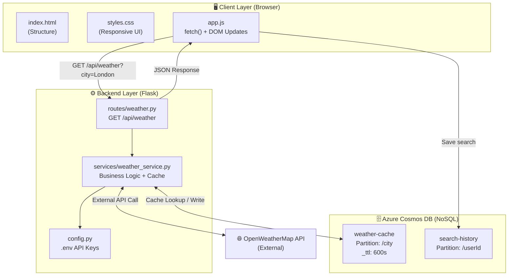
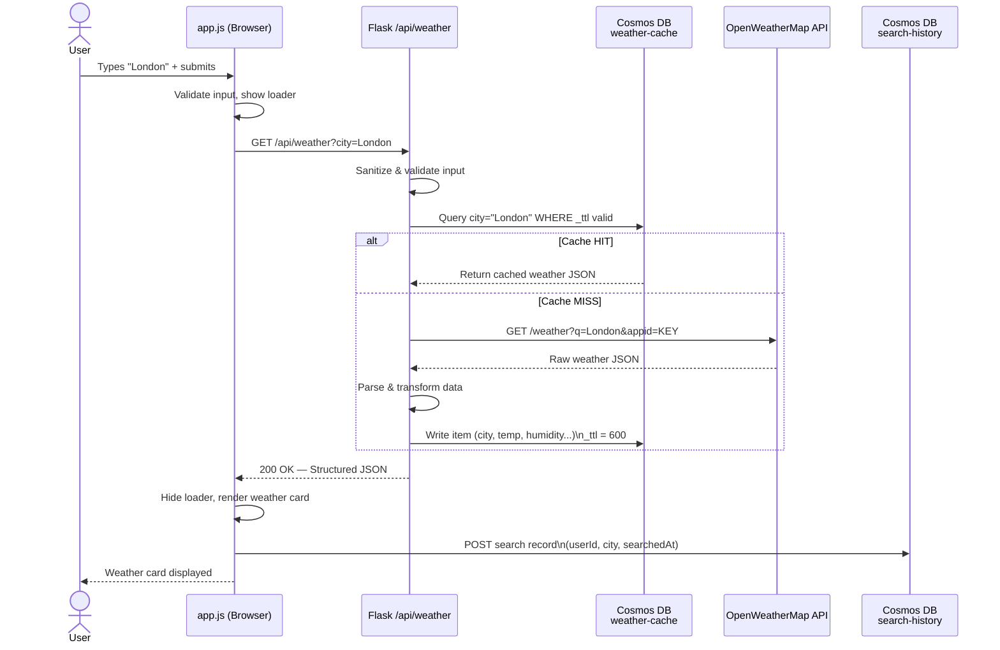
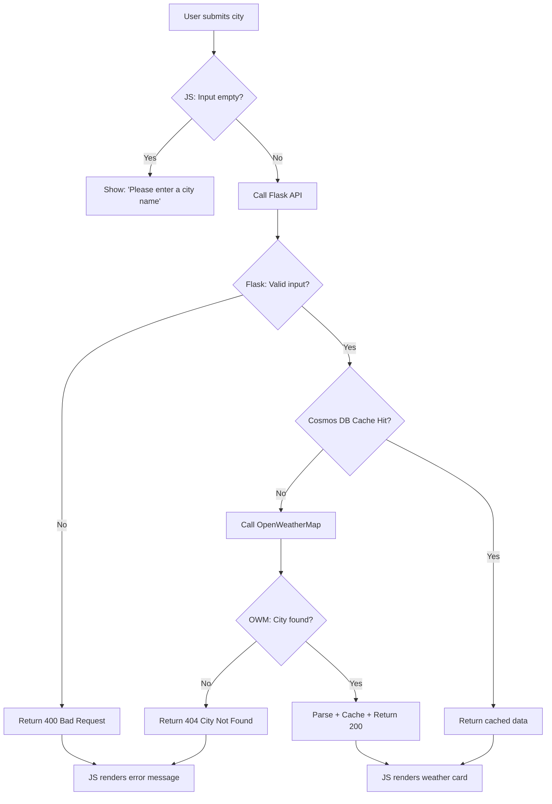

# Weather Dashboard App — Plan

## Functional Requirements

### Frontend (HTML + CSS + JavaScript)
- **FR1** — User can type a city name into an input field and submit it.
- **FR2** — App displays current weather data for the searched city, including:
  - Temperature (°C / °F)
  - Weather condition (e.g., Sunny, Rainy)
  - Humidity percentage
  - Wind speed
  - Weather icon
  - City name and country code
- **FR3** — User can toggle between Celsius and Fahrenheit.
- **FR4** — App displays a loading indicator while fetching data.
- **FR5** — App displays a user-friendly error message for invalid city names.
- **FR6** — Search history is shown (last 5 searches) for quick re-access.

### Backend (Flask)
- **FR7** — Flask exposes a REST API endpoint `GET /api/weather?city={cityName}`.
- **FR8** — Backend fetches weather data from a third-party API (e.g., OpenWeatherMap).
- **FR9** — Backend validates the city name input (non-empty, no special characters).
- **FR10** — Backend returns a structured JSON response to the frontend.
- **FR11** — Backend returns meaningful HTTP error codes (`400`, `404`, `500`).

---

## Non-Functional Requirements

### Performance
- **NFR1** — API response time should be **under 2 seconds** for 95% of requests.
- **NFR2** — Backend should **cache** recent city weather responses (e.g., TTL of 10 minutes) to reduce third-party API calls.

### Reliability
- **NFR3** — App should handle third-party API failures gracefully with a fallback error message.
- **NFR4** — Flask backend should implement **retry logic** for transient third-party API failures.

### Security
- **NFR5** — Third-party API keys must be stored in **environment variables**, never hardcoded.
- **NFR6** — Backend must **sanitize and validate** all user inputs to prevent injection attacks.
- **NFR7** — CORS should be **restricted** to allowed origins only.

### Usability
- **NFR8** — UI must be **responsive** and work on mobile, tablet, and desktop.
- **NFR9** — Error messages must be **human-readable** and clearly visible.
- **NFR10** — App should be accessible (**WCAG 2.1 AA**) — proper labels, contrast ratios.

### Maintainability
- **NFR11** — Code should follow a **clear folder structure** separating frontend and backend.
- **NFR12** — Backend logic should be modular (routes, services, config separated).

### Scalability
- **NFR13** — Backend should be **stateless** to allow horizontal scaling if needed.

---

## Suggested Project Structure

```
weather-dashboard/
├── backend/
│   ├── app.py                      # Flask entry point
│   ├── routes/
│   │   └── weather.py              # /api/weather route
│   ├── services/
│   │   └── weather_service.py      # Third-party API calls + caching
│   ├── config.py                   # Env vars & config
│   └── requirements.txt
├── frontend/
│   ├── index.html
│   ├── css/
│   │   └── styles.css
│   └── js/
│       └── app.js
└── .env                            # API keys (never commit this)
```

---

## System Architecture (Mermaid)



---

## Request Data Flow (Mermaid)



---

## Error Flow (Mermaid)



---

## Azure Cosmos DB Data Model

### Container 1 — `weather-cache`

| Field        | Type   | Description                      |
|---|---|---|
| `id`         | string | City name (unique)               |
| `city`       | string | **Partition Key**                |
| `country`    | string | Country code                     |
| `temp_c`     | float  | Temp in Celsius                  |
| `humidity`   | int    | Humidity %                       |
| `wind_speed` | float  | Wind in km/h                     |
| `condition`  | string | Weather description               |
| `icon`       | string | Icon code                        |
| `cachedAt`   | string | ISO timestamp                    |
| `_ttl`       | int    | `600` (10 min auto-expire)       |

### Container 2 — `search-history`

| Field            | Type   | Description                        |
|---|---|---|
| `id`             | string | UUID                               |
| `userId`         | string | **Partition Key** (high cardinality) |
| `city`           | string | Searched city                      |
| `searchedAt`     | string | ISO timestamp                      |
| `result_summary` | object | Embedded temp + condition          |

---

## Tech Stack Summary

| Layer          | Technology                         |
|---|---|
| Frontend       | HTML5 + CSS3 + Vanilla JavaScript  |
| Backend        | Python + Flask                     |
| External API   | OpenWeatherMap REST API            |
| Database/Cache | Azure Cosmos DB (NoSQL, SQL API)   |
| Auth/Config    | `.env` + `python-dotenv`           |
| Local Dev DB   | Azure Cosmos DB Emulator           |
| Dev Tooling    | VS Code + Cosmos DB Extension      |
