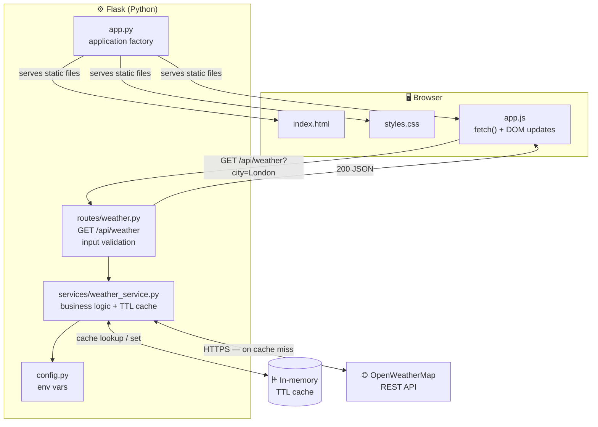
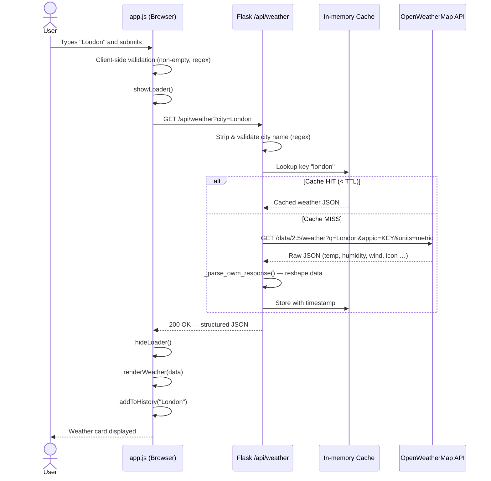
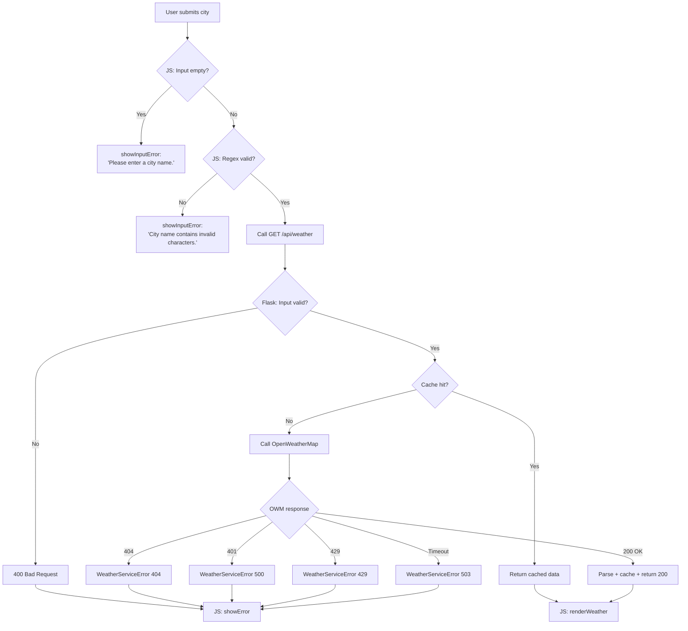

# Architecture — CognizantWeatherApp

This document describes the technical architecture of CognizantWeatherApp: how the layers are structured, how data flows between them, and how errors are handled.

---

## Table of Contents

- [Overview](#overview)
- [Tech Stack](#tech-stack)
- [Component Breakdown](#component-breakdown)
  - [Frontend](#frontend)
  - [Backend](#backend)
- [System Architecture Diagram](#system-architecture-diagram)
- [Request / Response Flow](#request--response-flow)
- [Error Handling Flow](#error-handling-flow)
- [Caching Strategy](#caching-strategy)
- [Security Design](#security-design)

---

## Overview

CognizantWeatherApp follows a traditional **client–server** pattern:

1. A **static frontend** (HTML + CSS + JS) runs in the browser and talks to the backend via `fetch()`.
2. A **Flask backend** validates inputs, consults an in-memory TTL cache, and — on a miss — calls the OpenWeatherMap REST API.
3. The structured response is returned as JSON and rendered by the frontend without a page reload.

Flask serves the static frontend files directly, so only **one process and one port** are needed in development and production.

---

## Tech Stack

| Layer | Technology | Version |
|---|---|---|
| Frontend | HTML5 + CSS3 + Vanilla JavaScript | — |
| Backend | Python + Flask | Flask ≥ 3.0 |
| HTTP client | `requests` with `urllib3` retry | ≥ 2.31 |
| CORS | `flask-cors` | ≥ 4.0 |
| Configuration | `python-dotenv` | ≥ 1.0 |
| Production server | `gunicorn` | latest |
| External API | OpenWeatherMap `/data/2.5/weather` | free tier |
| CI/CD | GitHub Actions | — |
| Cloud hosting | Azure App Service (Linux) | — |

---

## Component Breakdown

### Frontend

| File | Responsibility |
|---|---|
| `frontend/index.html` | App shell: header, search form, loading indicator, error banner, weather card, history section, footer |
| `frontend/css/styles.css` | Animated sky-gradient background, glassmorphism card, responsive layout (mobile-first), accessibility helpers |
| `frontend/js/app.js` | All dynamic behaviour — fetch, DOM rendering, unit toggle, localStorage history, error display |

**Key frontend modules (inside `app.js`):**

| Section | What it does |
|---|---|
| `fetchWeather(city)` | Calls `GET /api/weather?city=…` and parses the JSON response |
| `renderWeather(data)` | Populates the weather card with city, temperature, icon, stats |
| `updateTemperatureDisplay(tempC)` | Re-renders temperature and "feels like" when the unit toggles |
| `setUnit(unit)` | Switches between °C / °F and updates ARIA state on the toggle buttons |
| `addToHistory / renderHistory` | Maintains a deduplicated list of the last 5 searched cities in localStorage |
| `showLoader / hideLoader / showError` | UI state machine — only one of loader / error / card is visible at a time |

### Backend

| File | Responsibility |
|---|---|
| `backend/app.py` | Application factory (`create_app`): registers blueprints, configures CORS, serves static frontend, exposes `/api/health` |
| `backend/config.py` | `Config` class reads all settings from environment variables via `python-dotenv`; `validate_config` raises at startup if `OWM_API_KEY` is missing |
| `backend/routes/weather.py` | Blueprint `weather_bp` — mounts at `/api`; validates city name with a regex, then delegates to the service layer |
| `backend/services/weather_service.py` | Business logic: cache lookup → OWM HTTP call → response parsing → cache write |

---

## System Architecture Diagram



---

## Request / Response Flow



---

## Error Handling Flow



---

## Caching Strategy

The backend uses a **thread-safe in-memory dictionary** (`_cache`) guarded by `threading.Lock()`.

```
_cache = {
  "london": {
    "data":      { city, country, temp_c, … },
    "cached_at": 1709380800.0   # Unix timestamp
  }
}
```

**Cache key:** lowercase city name (e.g. `"london"`).  
**TTL check:** `(time.time() - entry["cached_at"]) < CACHE_TTL_SECONDS`.  
**Default TTL:** 600 seconds (10 minutes), configurable via `CACHE_TTL_SECONDS`.

| Scenario | Outcome |
|---|---|
| Cache HIT (fresh) | Returns cached data immediately; no OWM call |
| Cache MISS | Calls OWM, parses response, stores result, returns data |
| Cache STALE (> TTL) | Treated as a miss; fetches fresh data |

> **Note:** The cache is per-process. When deploying with multiple gunicorn workers, each worker has its own cache — this is acceptable for a 10-minute TTL weather use case.

---

## Security Design

| Concern | Implementation |
|---|---|
| **API key storage** | Loaded from `.env` via `python-dotenv`; never hardcoded; `.env` is in `.gitignore` |
| **Input validation** | Backend regex `^[a-zA-Z\u00C0-\u024F\s\-'.]{1,100}$` before any service call |
| **CORS** | Restricted to explicit origins (`CORS_ORIGINS` env var); defaults to `localhost` only |
| **Dependency management** | Pinned minimum versions in `requirements.txt`; retry logic avoids cascading failures |
| **Secret rotation** | `SECRET_KEY` and `OWM_API_KEY` are injected via GitHub Secrets at deploy time |
| **Debug mode** | `FLASK_DEBUG=false` in production (enforced in the GitHub Actions `.env` creation step) |
